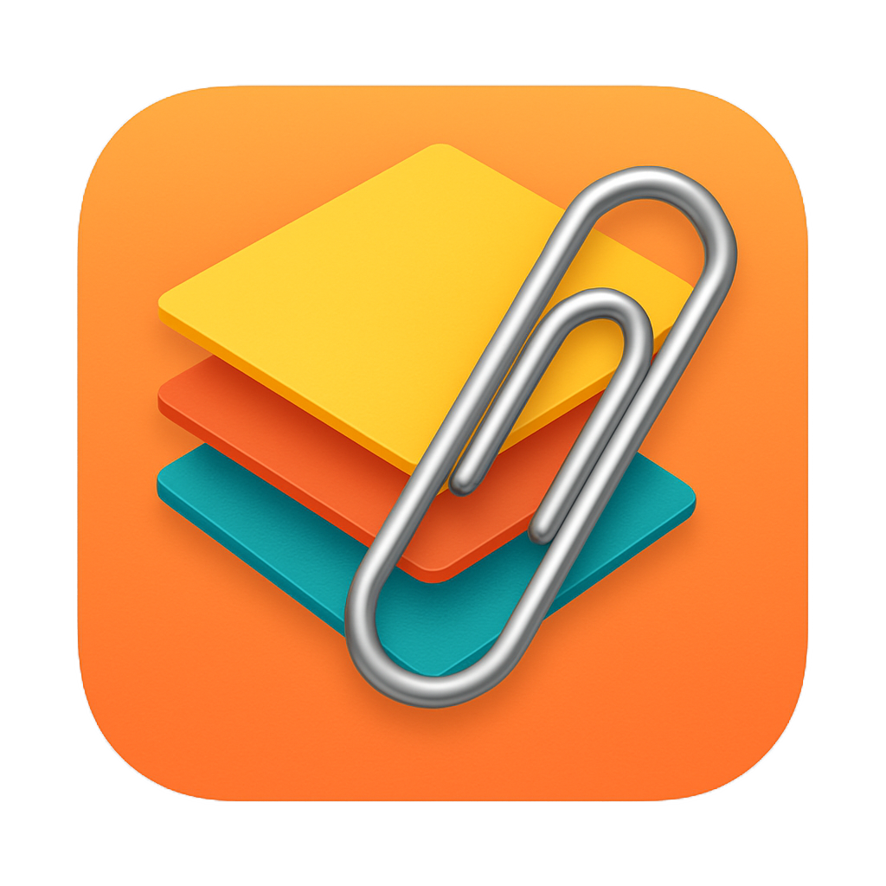
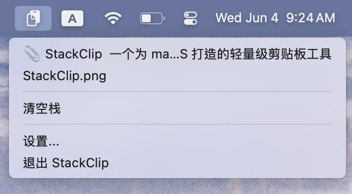
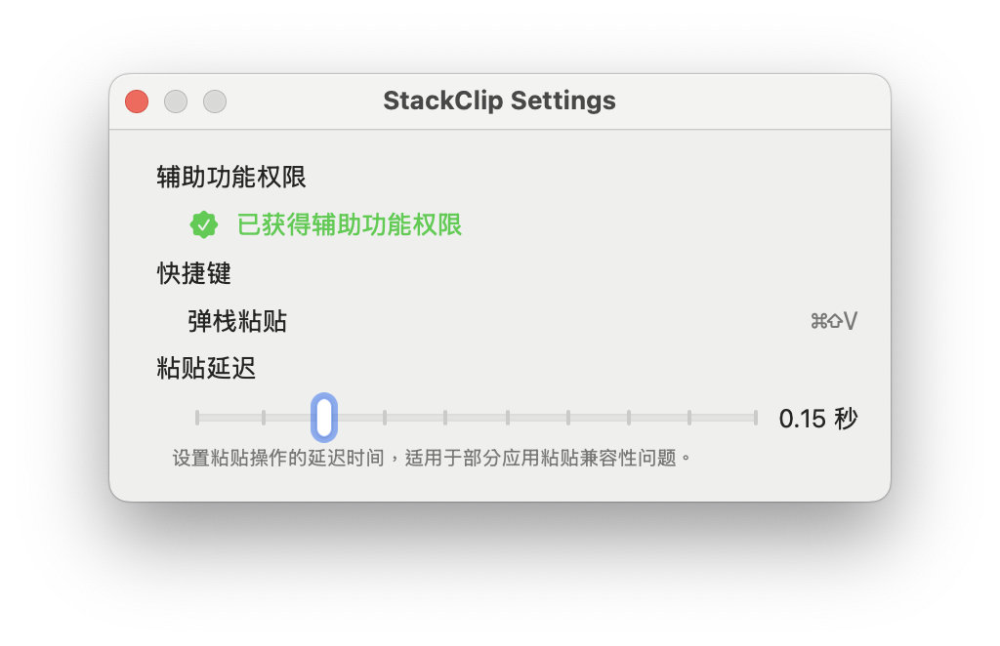

# 📎 StackClip

一个为 macOS 打造的轻量级剪贴板工具，支持栈式管理、快捷键粘贴、图文混合内容处理，并尽可能保持原生剪贴板体验。

<div align="center">
  
</div>

---

## ✨ 特性

- 📋 **栈式剪贴板管理**：最新复制内容压栈，支持弹栈粘贴；
- 💾 **原生兼容性**：对剪贴板行为无侵入，保留系统默认行为；
- 🔁 **支持多种类型**：纯文本、富文本、图片等可完整还原粘贴；
- ⌨️ **快捷键粘贴**：支持自定义弹栈粘贴快捷键；
- 🧠 **智能延迟**：根据内容复杂度动态调整粘贴延迟；
- 🖥️ **控制栏图标**：点击图标快速查看当前剪贴板栈内容；
- 🔐 **隐私优先**：本地运行、无网络依赖。

---

## 📸 预览
<div align="center">


<text>点击菜单栏图标查看剪贴板栈</text>



<text>设置界面</text>
</div>

---

## 🔧 安装与运行

### 从源代码构建（需要 macOS + Xcode）

```bash
git clone https://github.com/ShirakawaMio/StackClip.git
cd StackClip
open StackClip.xcodeproj
```

点击 Xcode 中的 ▶️ 运行即可启动 App。

首次运行请在「系统设置 > 隐私与安全 > 辅助功能」中授权，以支持自动粘贴功能。

---

## 🛠️ 配置项

- ⌨️ 自定义弹栈快捷键（todo）
- 🕒 设置粘贴延迟
- 🔒 权限提醒与辅助功能检测

---

## 💡 TODO

- [ ] 剪贴板内容预览增强（图文混排渲染）
- [ ] iCloud 同步栈内容
- [ ] 高级过滤规则（按类型保留/忽略）
- [ ] 支持自定义弹栈快捷键

---

## 🙏 致谢

本项目使用了以下开源库：

- [HotKey](https://github.com/soffes/HotKey)
- [SwiftUI](https://developer.apple.com/xcode/swiftui/)

---

[MIT License](./LICENSE) © 2025 [Shirakawa Mio](https://github.com/ShirakawaMio)
