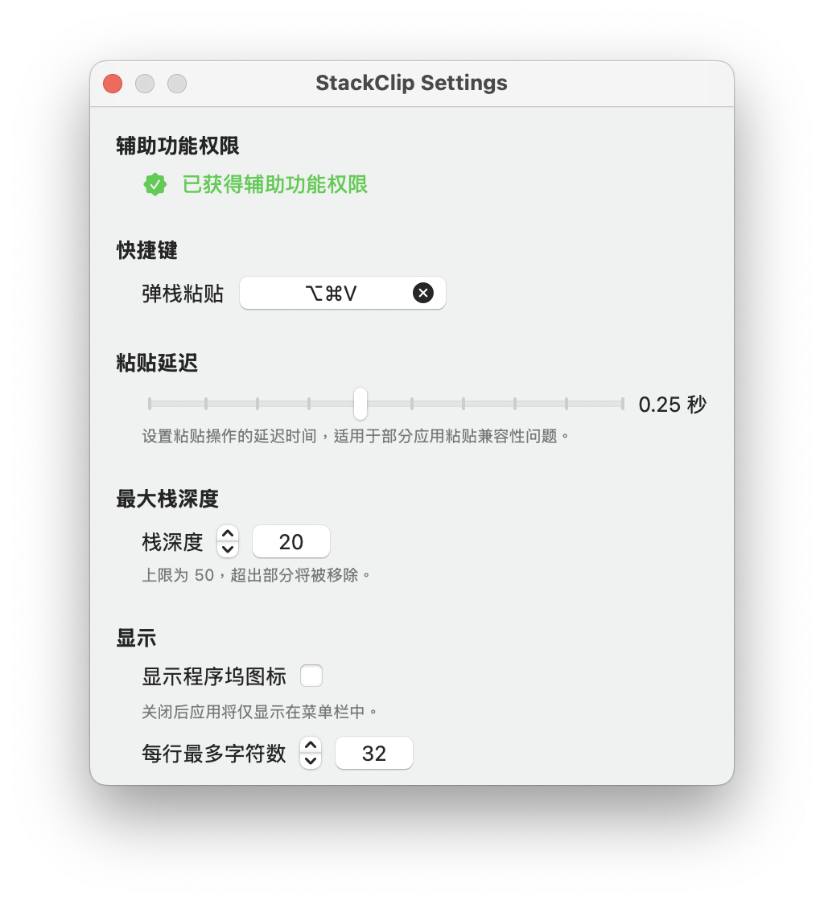

# 📎 StackClip

一个为 macOS 打造的轻量级剪贴板工具，支持栈式管理、快捷键粘贴、图文混合内容处理，并尽可能保持原生剪贴板体验。

<div align="center">
  
</div>

---

## ✨ 特性

- 📋 **栈式剪贴板管理**：最新复制内容压栈，支持弹栈粘贴；
- 💾 **原生兼容性**：对剪贴板行为无侵入，保留系统默认行为；
- 🔁 **支持多种类型**：纯文本、富文本、图片等可完整还原粘贴；
- ⌨️ **快捷键粘贴**：支持自定义弹栈粘贴快捷键；
- 🧠 **智能延迟**：根据内容复杂度动态调整粘贴延迟；
- 🖥️ **控制栏图标**：点击图标快速查看当前剪贴板栈内容；
- 🔐 **隐私优先**：本地运行、无网络依赖。
- 🧩 **每个栈位支持快捷键访问(todo)**：可使用数字键快速粘贴特定栈元素；
- 🧾 **剪贴内容类型提示(todo)**：区分文本、图片、富文本等类型；
- 🚫 **剪贴板内容过滤规则(todo)**：可选过滤密码、验证码等敏感内容；
- 🖱️ **菜单栏支持拖拽重排序(todo)**：可手动调整剪贴项顺序；

---

## 📸 预览
<div align="center">


<text>点击菜单栏图标查看剪贴板栈</text>



<text>设置界面</text>
</div>

---

### 安装方式

#### 方式一：下载安装包

在 [Releases](https://github.com/ShirakawaMio/StackClip/releases) 中下载最新的安装包。
下载后打开安装包，将 StackClip.app 拖入应用程序文件夹即可。

#### 方式二：从源代码构建

```bash
git clone https://github.com/ShirakawaMio/StackClip.git
cd StackClip
open StackClip.xcodeproj
```
点击 Xcode 中的 ▶️ 运行即可启动 App。

---

## 🛠️ 配置项

- ⌨️ 自定义弹栈快捷键
- 🕒 设置粘贴延迟
- 🔒 权限提醒与辅助功能检测
- 🖥️ 程序坞图标显示/隐藏
- 📜 菜单显示字数限制

---

## 💡 TODO

- [ ] 剪贴板内容过滤规则
- [ ] 剪贴内容类型提示
- [ ] 栈位自动分配快捷键
- [ ] 菜单栏支持鼠标拖拽重排序

---

## 🙏 致谢

本项目使用了以下开源库：

- [KeyboardShortcuts](https://github.com/sindresorhus/KeyboardShortcuts)
- [SwiftUI](https://developer.apple.com/xcode/swiftui/)

---

[MIT License](./LICENSE) © 2025 [Shirakawa Mio](https://github.com/ShirakawaMio)
